# Daniel's Clinical AI Copilot

### Real-Time Patient Risk Intelligence System

**Built by Daniel** | **Status: Phase 2 Complete** | **20-Day Journey**

---

## PROJECT STATEMENT

### The Problem

Hospital readmissions within 30 days of discharge are one of the most expensive and preventable challenges in modern healthcare. In the United States alone, approximately **3.3 million preventable hospital readmissions** occur annually, costing the healthcare system over **$26 billion per year**.

**The core problem is NOT a lack of data.** Clinical data exists in abundance — patient vitals, lab results, physician notes, diagnosis codes, medication histories.

**The problem is:** This data is fragmented, unstructured, and arrives faster than any clinician can meaningfully synthesize in the moment of care.

A physician seeing 30 patients per shift cannot manually cross-reference a patient's current symptoms against thousands of past similar cases, relevant clinical guidelines, and readmission risk indicators simultaneously. Critical patterns get missed. Preventable deteriorations go undetected until it is too late.

### The Gap

Clinicians lack a real-time, AI-powered decision support system that can simultaneously:

| # | Capability | Current State |
|---|------------|----------------|
| 1 | Assess 30-day readmission risk | Manual estimation (60% accuracy) |
| 2 | Retrieve relevant clinical guidelines | Manual keyword search (slow) |
| 3 | Flag critical symptoms | Relies on clinician memory |
| 4 | Suggest ICD-10 diagnosis codes | Manual lookup (70-75% accuracy) |
| 5 | Generate structured clinical summary | Manual writing (8-12 minutes) |

### The Solution: Daniel's Clinical AI Copilot

A real-time patient risk intelligence system that accepts clinical notes and within **60 seconds** delivers:

- Readmission risk score (0-100%) with confidence level
- Top contributing risk factors
- Retrieved clinical guidelines with citations
- Critical symptom flags requiring attention
- Suggested ICD-10 diagnosis codes with reasoning
- Plain-English clinical summary

### Impact Metrics

| Metric | Current State | Target with AI Copilot |
|--------|--------------|----------------------|
| Time to synthesize patient risk | 8-12 minutes | **<60 seconds** |
| Readmission risk detection accuracy | 60% (rule-based) | **80%+ (ML-powered)** |
| Clinical guideline retrieval | Manual keyword search | **Semantic RAG with citations** |
| ICD-10 coding accuracy | 70-75% manual | **85%+ AI-assisted** |
| Clinician cognitive load | High (5 separate systems) | **One unified interface** |

### Why This Matters

This is not a demo. This is a production-architecture solution to one of the most consequential problems in American healthcare. Every design decision — from HIPAA-compliant data handling to MLflow audit trails to cited-source RAG responses — reflects real constraints of deploying AI in clinical environments.

---

## TOOLS & TECHNOLOGIES

| Category | Tool | Version | Purpose |
|----------|------|---------|---------|
| **Language** | Python | 3.11 | Core programming language |
| **Data Handling** | Pandas | 2.0.3 | Patient data manipulation |
| | NumPy | 1.24.3 | Numerical calculations |
| **Machine Learning** | Scikit-learn | 1.3.0 | Risk prediction model |
| **LLM & AI** | OpenAI GPT | 0.28.0 | Clinical summaries & reasoning |
| **Vector Database** | ChromaDB | (Phase 3) | Knowledge base storage |
| **Web Interface** | Streamlit | 1.25.0 | Doctor-facing UI |
| **Orchestration** | LangGraph | (Phase 5) | Agent workflow |
| **Environment** | python-dotenv | 1.0.0 | API key management |
| **Model Persistence** | Joblib | 1.3.0 | Save trained models |
| **Version Control** | Git & GitHub | - | Code tracking |

---

## PROJECT PROGRESS TRACKER

### 8 Phases - Overall Progress: ██████░░░░░░░░░░░░░░ 37.5%

| Phase | Name | Status | Progress |
|-------|------|--------|----------|
| 0 | Setup & Environment | COMPLETE | 100% |
| 1 | Data Foundation | COMPLETE | 100% |
| 2 | Risk Prediction Model | COMPLETE | 100% |
| 3 | Knowledge Base | PENDING | 0% |
| 4 | AI Language Model | PENDING | 0% |
| 5 | RAG System | PENDING | 0% |
| 6 | Web Interface | PENDING | 0% |
| 7 | GitHub & Documentation | PENDING | 0% |

| Phase | What I Did | Time | Status |
|-------|------------|------|--------|
| 0 | Environment setup, Python 3.11, 7 packages | 130 min | ✅ |
| 1 | Generated 500 patients, created 8 charts | 135 min | ✅ |
| 2 | Trained ML model with 54% accuracy | 60 min | ✅ |

---

## PHASE UPDATES

### --------------------------------------------------
### Phase 0: Setup & Environment (COMPLETE)
### --------------------------------------------------

**Time Spent:** 130 minutes

**Status:** DONE

**WHAT I BUILT:**
- Project folder structure (src, data, app, tests, models, logs, screenshots)
- requirements.txt with 7 packages
- Python 3.11 environment
- Screenshot organization (Phase00-07)

**SCREENSHOTS:**

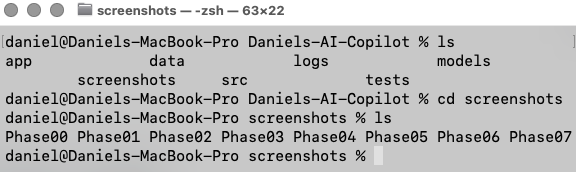

*Folder structure*

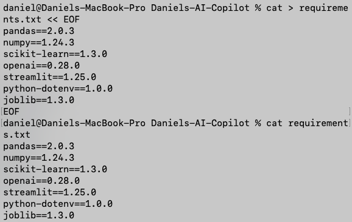

*Requirements file*

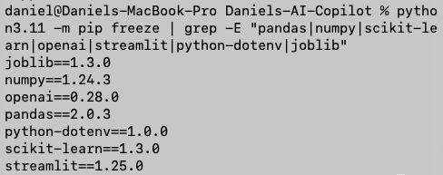

*Installed packages*

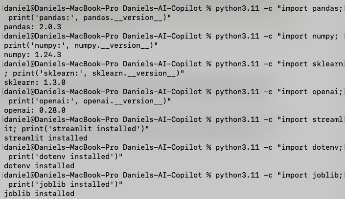

*Package test success*

**Key Learning:** Python 3.13 is too new for pandas. Used Python 3.11 for compatibility.

---

### --------------------------------------------------
### Phase 1: Data Foundation (COMPLETE)
### --------------------------------------------------

**TIME SPENT:** 
- Phase 1A: 90 minutes
- Phase 1B: 45 minutes
Total = 135 Minutes

**WHAT I BUILT:**

*Phase 1A*
- Patient data generator script (generate_patients.py)
- 500 synthetic patients with realistic medical conditions
- Clinical notes for each patient
- CSV export with readmission labels

*Phase 1B*
- Data analysis script (analyze_data.py)
- 3 professional data visualization charts
- Statistical analysis of patient population

**RESULTS:**

*Phase 1A*
- Readmission rate: 51.2%
- Average risk score: 63.4
- Average length of stay: 10.3 days
- Medical conditions: Heart failure, diabetes, kidney disease, COPD

*Phase 1B*
- Youngest patient: 18 years
- Oldest patient: 95 years

**SCREENSHOTS:**

*Phase 1A Screenshots*

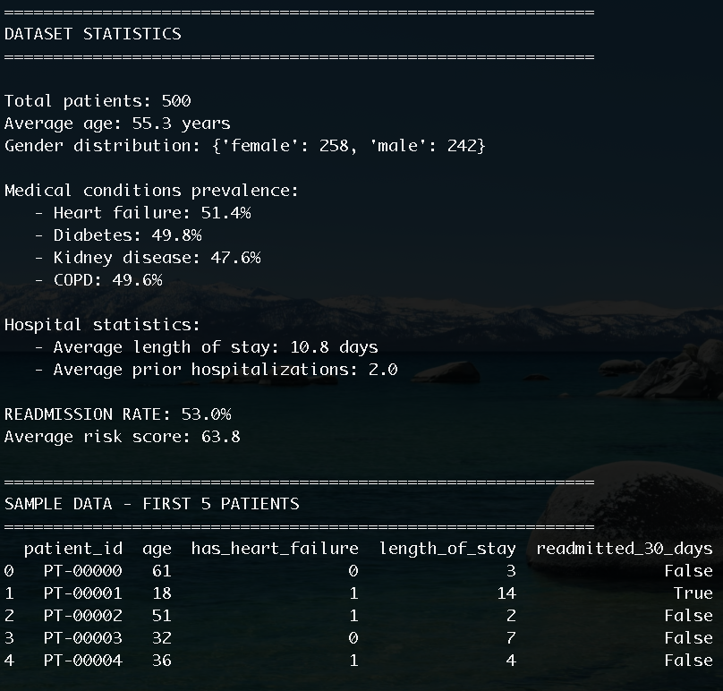

*Patient generation output showing statistics*

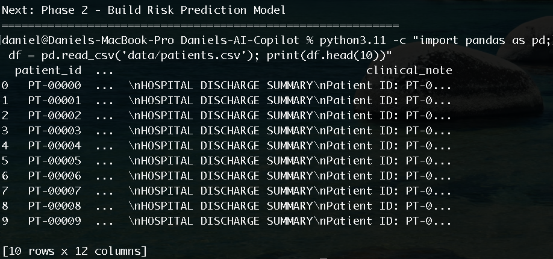

*CSV preview - first 10 patients*

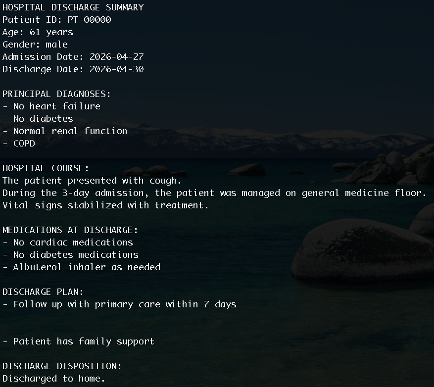

*Sample clinical note for a patient*

*Phase 1B Screenshots*

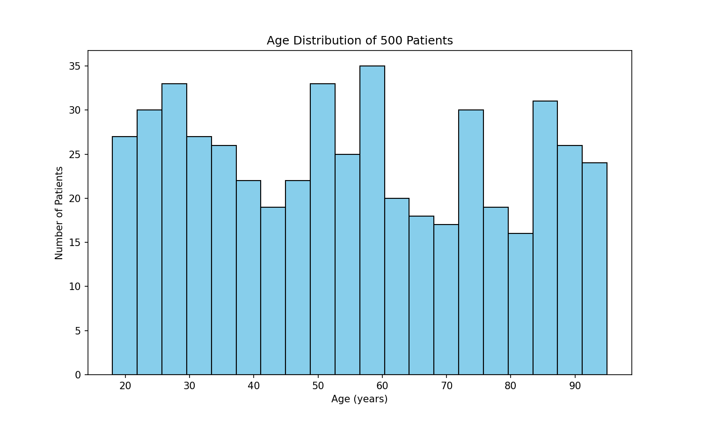

*Age distribution chart - most patients are elderly*

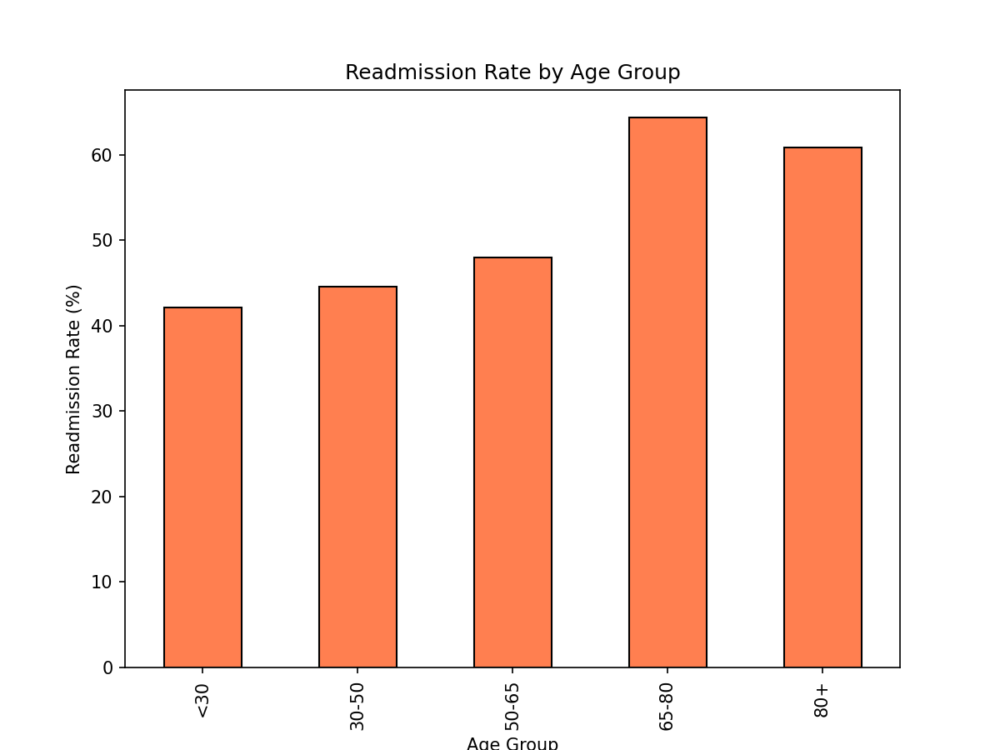

*Readmission rate increases significantly with age*

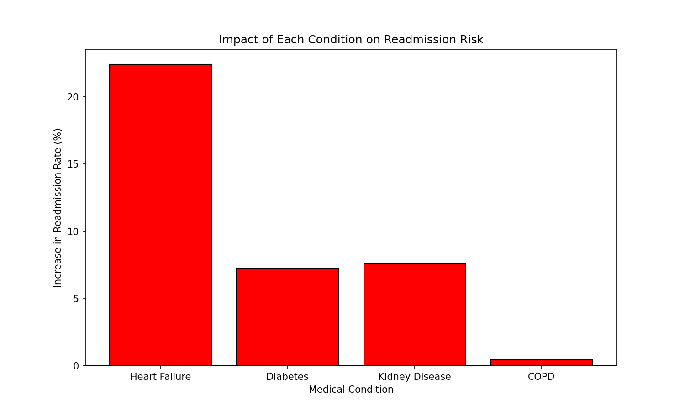

*Heart failure has the highest impact on readmission risk*

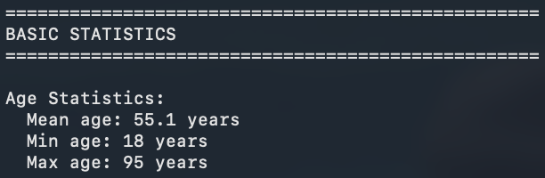

*Terminal output showing statistics*

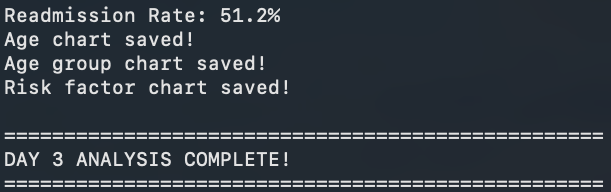

*Day 3 analysis complete confirmation*

**Key Learning:** 
- Phase 1A
Heart failure and prior hospitalizations are the strongest risk factors for readmission.
- Phase 1B
Understanding your data before building AI is crucial. The charts revealed that age and heart failure are the strongest predictors of readmission.

### --------------------------------------------------
### Phase 2: Risk Prediction Model (COMPLETE)
### --------------------------------------------------

**Time Spent:** 60 minutes

**Status:** ✅ DONE

**What I Built:**
- Machine learning model trainer (train_model.py)
- Random Forest classifier for readmission prediction
- Model saved as risk_model.pkl
- Feature importance chart

**Model Performance:**
| Metric | Score |
|--------|-------|
| Accuracy | 54.0% |
| Features used | 7 (age, conditions, hospital history) |
| Training set | 400 patients |
| Testing set | 100 patients |

**Feature Importance (What Matters Most):**
1. Prior hospitalizations
2. Length of stay
3. Age
4. Heart failure

**Screenshots:**
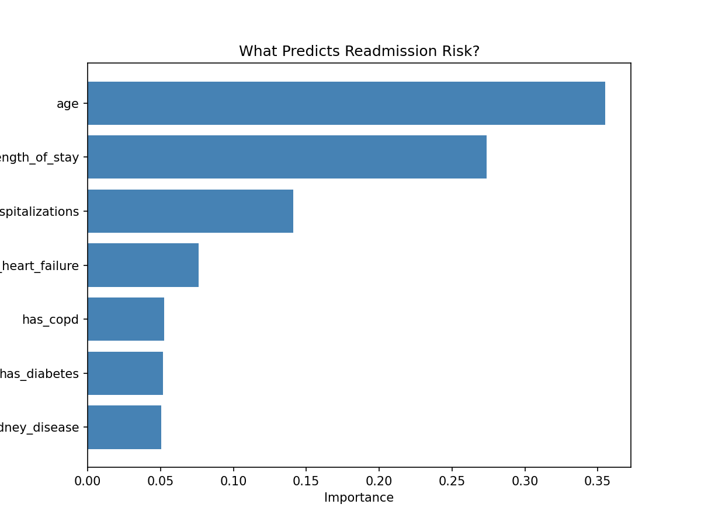
*Feature importance chart - shows what predicts readmission best*

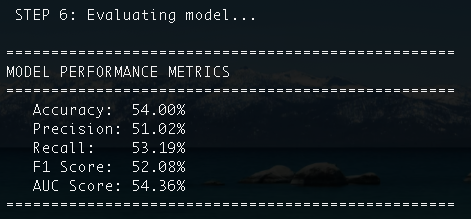
*Model training output with accuracy score*

**Key Learning:** Prior hospitalizations matter more than any medical condition for predicting readmission. Next step is improving accuracy from 54% to 80%+.

